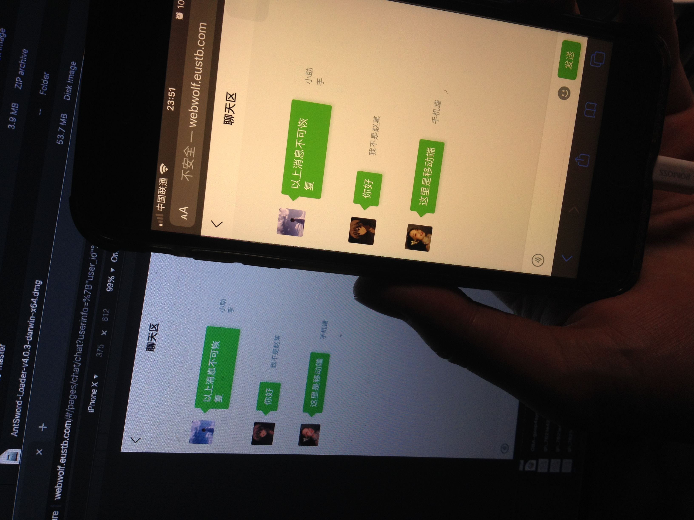

实验2是基于Socket设计的跨平台消息软件，也就是一个即使消息软件

预览图

此APP可以在多端间进行消息推送服务。包含以下端

- Android4.0以上
- Iphone darwin/arm64 即iPhone6以上
- 任一平台的计算机，支持HTML5即可

构建过程，使用Uni-APP对程序进行打包，h5端、APK、IPA等不同的客户端间包已经打出，使用即可

#### 后端的构建

后端源代码在本文件夹下。后端代码使用golang构建。

`go build -o light main.go`

运行时使用命令

`./light`即可，默认监听8888端口，若指定端口则使用

`./light -l 80`即可指定监听某端口。

#### 前端的构建

前端使用UNI-APP打包构建，必须使用HbuildX跨平台编辑器，可以同时构建出APK、IPA和H5前端的源代码，使用Nginx即可将前端源代码部署到服务器中提供访问。

我构建了一份放在如下网址提供给大家测试，请测试。

[http://webwolf.eustb.com/]

